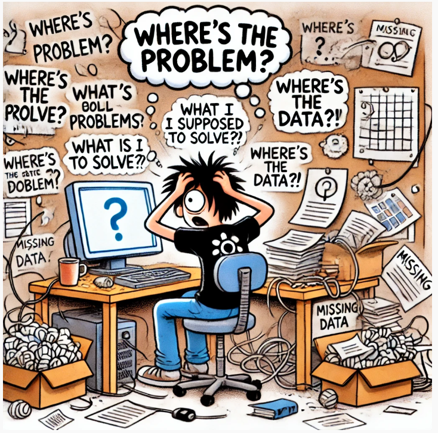
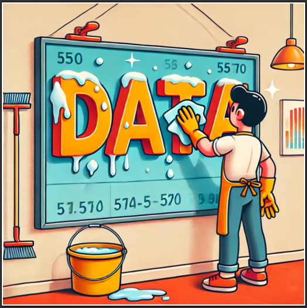
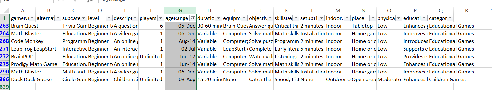

# Day 1: Problem Description




## Problem Selection

After exploring various options for a question and answer (Q&A) system, I chose to focus on developing a Games Instructor Assistant. This decision is fueled by my personal passion for games, ensuring that I stay engaged and motivated throughout the development process.

## Problem Description

To create an effective Q&A system, we must clearly define the specific problem we aim to address. For this project, the focus is on developing a system that assists users in finding games tailored to their needs.

## The Interactive Games Instructor Assistant

Imagine a comprehensive digital tool designed to help instructors, educators, and event organizers select and organize games for various contexts. **Interactive Games Instructor Assistant** leverages an extensive dataset of over 500 unique games, providing detailed information to guide users in choosing the most suitable games based on criteria such as:
- Age range
- Number of players
- Duration
- Educational benefits
- Physical intensity
- And more.


## Possible User Scenarios

### Scenario 1: The Educator's Challenge

#### Situation
**Emma**, a high school teacher, is preparing her next class on teamwork and communication skills. She wants to incorporate interactive games that not only engage her students but also reinforce the lesson objectives.

#### Motivation
Emma aims to find games that:
- Align with her curriculum goals.
- Cater to diverse learning styles and abilities.
- Can be completed within the class period.
- Require minimal preparation and resources.

Manually searching through numerous game options is time-consuming and often overwhelming, leaving Emma with limited time to effectively plan her lessons.

#### Outcome
Using the **Games Instructor Assistant**, Emma quickly identifies a selection of games that perfectly fit her criteria. The assistant provides detailed information about each game, including:
- Educational benefits.
- Required materials.
- Estimated duration.
- Instructions and variations.

This allows Emma to seamlessly integrate these games into her lessons, enhancing student engagement and achieving her teaching objectives without the added stress of extensive research.

#### Emma's Goal
---
**When** preparing lesson plans for an engaging and educational classroom environment,  
**I want** to efficiently find games that support my teaching goals and cater to my students' needs,  
**So that** I can enhance student participation and learning outcomes without spending excessive time searching for suitable activities.

---

### Scenario 2: The Event Organizer's Dilemma

#### Situation
**Mark**, an event organizer, is tasked with planning a team-building retreat for a group of corporate employees. The goal is to select games that promote collaboration, communication, and problem-solving skills among the participants.

#### Motivation
Mark seeks games that:
- Accommodate varying group sizes.
- Are suitable for outdoor activities.
- Engage participants with different skill levels.
- Foster a sense of teamwork and cooperation.
- Can be set up quickly and require minimal equipment.

With a tight deadline and a large number of game options available, Mark needs a reliable tool to help him make informed decisions swiftly.

#### Outcome
Mark leverages the **Games Instructor Assistant** to filter and select appropriate games based on his specific requirements. The assistant provides:
- A curated list of games that match the desired criteria.
- Detailed descriptions of each game.
- Equipment lists and setup instructions.
- Tips for facilitating the games effectively.

This enables Mark to organize a successful and impactful team-building event, ensuring that all participants are engaged and that the retreat meets its objectives.

#### Mark's Goal
---
**When** planning a corporate retreat focused on team development,  
**I want** to identify games that enhance collaboration and communication among employees,  
**So that** I can create a memorable and effective team-building experience without compromising on quality or time.

---

## Data Availability
The success of our Q&A system hinges on the availability of relevant data. To ensure we have what we need, we must first explore whether the necessary datasets are accessible online. If suitable datasets aren't available, we have the option to generate our own data. 

Fortunately, we can utilize tools like GPT-4o-mini for this purpose. My goal in generating data is not only to become proficient in data creation but also to prepare for scenarios where data may be scarce or unavailable.

## Data Generation with Chat-GPT

"I wanted to generate a dataset for building a games-instructor application and needed a comprehensive collection, so I asked ChatGPT to provide possible games."

### Answer with ChatGPT
Certainly! Building a comprehensive games-instructor application requires a diverse dataset covering various types of games. Below is a list of possible games categorized to help you select those that best fit your application's needs.

### Possible Games
#### Outdoor Sports and Games
- Team Sports: Soccer, Basketball, Volleyball, Baseball, Rugby, Hockey
- Racquet Sports: Tennis, Badminton, Squash, Table Tennis
- Track and Field: Sprinting, Long Jump, High Jump, Javelin Throw
- Water Sports: Swimming, Water Polo, Surfing, Kayaking
- Winter Sports: Skiing, Snowboarding, Ice Skating, Ice Hockey
- Other Outdoor Games: Capture the Flag, Frisbee, Paintball, Archery

#### Indoor Games
- Gym Activities: Aerobics, Yoga, Pilates, Indoor Cycling
- Martial Arts: Karate, Taekwondo, Judo, Kung Fu
- Dance Forms: Ballet, Hip-Hop, Salsa, Contemporary
- Recreational Games: Bowling, Billiards, Darts, Table Football

#### Board Games
- Classic Strategy: Chess, Checkers, Go, Backgammon
- Family Games: Monopoly, Scrabble, Clue, Life
- Cooperative Games: Pandemic, Forbidden Island, Gloomhaven
- Strategy and War Games: Risk, Axis & Allies, Catan
- Abstract Games: Azul, Blokus, Qwirkle

#### Card Games
- Traditional: Poker, Blackjack, Bridge, Rummy
- Collectible Card Games: Magic: The Gathering, Pokémon, Yu-Gi-Oh!
- Party Card Games: Cards Against Humanity, UNO, Exploding Kittens
- Deck-Building Games: Dominion, Ascension, Star Realms

#### Video Games
- Action and Adventure: The Legend of Zelda, Grand Theft Auto, Assassin's Creed
- Role-Playing Games (RPGs): Final Fantasy, The Witcher, Skyrim
- First-Person Shooters (FPS): Call of Duty, Halo, Counter-Strike
- Simulation Games: The Sims, Animal Crossing, Flight Simulator
- Sports Games: FIFA, NBA 2K, Madden NFL
- Puzzle and Indie Games: Tetris, Portal, Stardew Valley

#### Educational Games
- Math and Logic: Sudoku, Math Blaster, DragonBox
- Language Learning: Duolingo Games, Scrabble, Boggle
- Science and Exploration: Kerbal Space Program, Minecraft Education Edition
- History and Culture: Civilization Series, Oregon Trail, Age of Empires

#### Party Games
- Social Deduction: Werewolf, Mafia, Among Us
- Charades and Pictionary
- Trivia Games: Trivial Pursuit, Jeopardy!
- Physical Party Games: Twister, Musical Chairs, Limbo

#### Team-Building Games
- Trust Exercises: Trust Fall, Human Knot
- Problem-Solving Activities: Escape Rooms, Scavenger Hunts
- Communication Games: Telephone, Storytelling Rounds

### Additional Categories
- Physical Fitness Games: Obstacle Courses, Relay Races
- Children's Games: Hopscotch, Hide and Seek, Simon Says
- Mind Games and Brain Teasers: Riddles, Logic Puzzles, Escape Puzzles

### Question for ChatGPT

Now give me the possible columns.

### Answer from ChatGPT
Certainly! To build a comprehensive dataset for your games-instructor application, you'll want to include a variety of columns that capture all essential details about each game. Below is a list of possible columns, organized into categories for clarity.

#### Basic Information
- Game Name: The official name of the game.
- Alternate Names: Other names or variations the game is known by.
- Category: Main classification (e.g., Board Game, Outdoor Sport, Card Game).
- Subcategory: Specific type within the category (e.g., Strategy, Cooperative, Physical Fitness).
- Description: A brief summary of the game and its appeal.

#### Gameplay Details
- Objective: The main goal players aim to achieve in the game.
- Game Mechanics: Core principles or actions that drive gameplay (e.g., Dice Rolling, Role-Playing).
- Number of Players:
  - Minimum Players: The fewest number needed to play.
  - Maximum Players: The maximum number the game accommodates.
- Age Range: Recommended player ages (e.g., 8+, Teens, Adults).
- Average Duration: Typical length of a game session.
- Skill Level: Difficulty level (Beginner, Intermediate, Advanced).
- Luck vs. Strategy: Degree to which chance or planning affects outcomes.

#### Setup and Equipment
- Equipment Needed: List of all items required to play.
- Setup Time: Approximate time to prepare the game before play.
- Space Requirements: Physical area needed (e.g., Tabletop, Field, Room Size).
- Indoor/Outdoor: Suitable playing environment.
- Accessibility Requirements: Any special accommodations needed.

#### Rules and Instructions
- Detailed Rules: Comprehensive explanation of how to play.
- Step-by-Step Instructions: Sequential guide from setup to gameplay.
- Variations and House Rules: Popular modifications or alternative ways to play.
- Scoring System: How points are earned and calculated.
- End Conditions: How and when the game concludes.

#### Educational and Developmental Benefits
- Skills Developed: Cognitive, physical, social, or emotional skills enhanced.
- Learning Objectives: Specific educational goals (e.g., Math Skills, Teamwork).
- Curriculum Alignment: Relation to educational standards or programs.

#### Physical and Safety Considerations
- Physical Intensity Level: Low, Moderate, High.
- Safety Precautions: Potential risks and how to mitigate them.
- Required Physical Abilities: Necessary player capabilities.

#### Cultural and Historical Context
- Origin Country/Culture: Where the game originated.
- Historical Background: Any significant history or cultural importance.
- Cultural Sensitivity Notes: Important considerations to respect cultural origins.

### Question for ChatGPT
Give me 100 outdoor sports and games in csv format with columns: 

"id","gameName","alternateNames","subcategory","level",
"description", "playersMax", "ageRange", "duration", "equipmentNeeded",
"objective", "skillsDeveloped","setupTime", "indoorOutdoor", "place",
"physicalIntensityLevel", "educationalBenefits"

### Answer from ChatGPT
Certainly! Below is a CSV file containing outdoor sports and games with the specified columns.

```bash
"id","gameName","alternateNames","subcategory","level","description","playersMax","ageRange","duration","equipmentNeeded","objective","skillsDeveloped","setupTime","indoorOutdoor","place","physicalIntensityLevel","educationalBenefits"
"G001","Soccer","Football","Team Sport","Beginner to Professional","A team sport where players aim to score goals by getting the ball into the opposing team's net without using their hands or arms.",22,"4+","90 minutes","Soccer ball; Goals; Cleats; Shin guards","Score more goals than the opposing team within the allotted time.","Teamwork; Coordination; Physical fitness","10-15 minutes","Outdoor","Soccer field or pitch","High","Promotes physical fitness, teamwork, and strategic thinking"
"G002","Ultimate Frisbee","Ultimate","Team Sport","Beginner to Advanced","A non-contact team sport played with a flying disc, where teams score by catching the disc in the opposing end zone.",14,"10+","60-90 minutes","Frisbee (flying disc)","Score points by catching the disc in the opposing team's end zone.","Throwing skills; Endurance; Teamwork","5-10 minutes","Outdoor","Open field","High","Enhances coordination, teamwork, and promotes fair play"
"G003","Capture the Flag","","Outdoor Game","Beginner to Intermediate","A game where two teams try to capture the opposing team's flag and return it to their own base without being tagged.",,"8+","30-60 minutes","Two flags or markers","Capture the opposing team's flag and bring it back to your own territory.","Strategy; Teamwork; Physical fitness","10 minutes","Outdoor","Large open area with defined boundaries","Moderate to High","Encourages strategic thinking, teamwork, and physical activity"
... (continue with other games)
```
Since ChatGPT was not able to provide complete data, you can use the provided sample CSV structure to create additional entries as needed. 


## Data Cleaning 


Now that we have defined the columns in our dataset, the next step is to tackle any issues that arose during data creation. I encountered several problems that were not effectively resolved using Python, so I decided to use Microsoft Excel for data cleaning.

To organise the data more effectively, I added a category column and saved each file under category names, such as `card.csv`, `children.csv`, and so on. I then concatenated these files to create a comprehensive CSV file containing a total of 637 rows. Each entry can be accessed [data-each-category](../data/dataset-all.csv).


### Modifications Made

- **Column Adjustments:**
  - Removed the **id** column entirely to streamline the dataset.
  - Introduced a **gameId** column to uniquely identify each game entry.
  - Eliminated the **indoorOutdoor** column, as it was redundant and interfered with the category column.

- **Data Validation:**
  - Checked for blank values across the dataset:
    - For **Alternate Names**, replaced empty entries with `None`.
    - For **PlayersMax**, marked any missing values as `Not specified`.
  
- **Duplicate Removal:**
  - Conducted a thorough check to identify and remove duplicate entries, ensuring uniqueness while excluding the **gameId** column.

- **Data Integrity:**
  - Deleted rows lacking values in the **ageRange** field, as this information is crucial for categorizing games appropriately.


### Final Data 

Following a thorough data cleaning process, the final dataset has been refined to **590 rows**, ensuring both accuracy and relevance. You can access the finalized data [here](../data/game-dataset.csv).

---

✨ **Tips of the Day** ✨

1. **Choose Your Passion:** If you're starting a personal project and feeling uncertain, select an area that genuinely excites you. Passion fuels motivation!

2. **Know Your Audience:** Consider your target audience and who will be using your application. Understanding their needs is crucial for creating a valuable tool.

3. **Simplify Data Cleaning:** While data cleaning can be accomplished in Python, using Excel often provides a more intuitive experience. Its visual sorting and filtering capabilities make spotting data anomalies easier.

4. **Handle Missing Values Smartly:** For blank values in string columns, use terms like "none," "not specified," or "unknown." For numerical columns, consider replacing missing values with the column mean.

5. **Leverage ChatGPT:** Remember that ChatGPT is a fantastic resource! Don’t hesitate to ask for simple explanations or clarification on complex topics.

---

This concludes the **Day 1** problem description and data generation process.

## Next Steps

Stay tuned for **Day 2**, where we’ll explore the RAG flow and its implementation. For more details, check out the [Knowledge Base and LLM in RAG Flow](../2-RAG-flow/RAG-flow.md).


