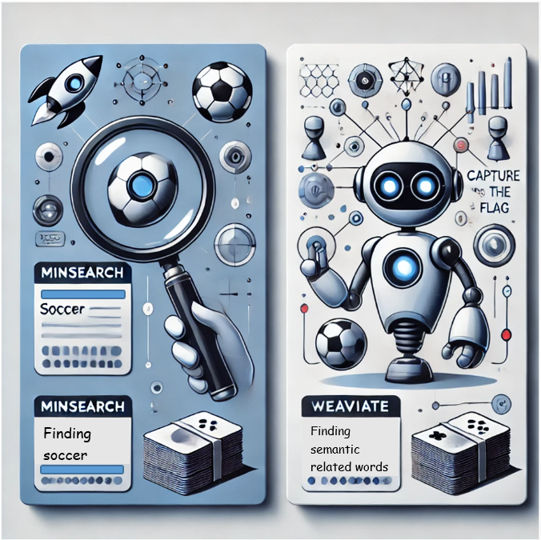
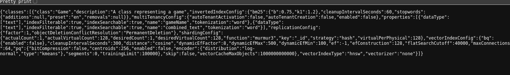
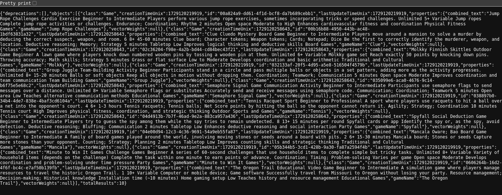

# Integration Guide: Minsearch and Weaviate

Integrating **Minsearch** and **Weaviate** allows you to offer both keyword-based and semantic search capabilities in your game recommendation system. **Minsearch** is perfect for fast, precise keyword-based filtering and ranking, while **Weaviate** provides powerful, context-aware semantic search to surface more meaningful and relevant game suggestions.



## 1. Minsearch with `minsearch.py`


Minsearch is a lightweight, keyword-based search engine that utilizes **TF-IDF (Term Frequency-Inverse Document Frequency)** to index and rank text data. It is particularly suited for applications requiring fast and efficient searches, such as a game recommendation engine.


### 1.1 Installing Dependencies

First, ensure that you have the required dependencies installed:

```bash
pip install pandas scikit-learn numpy
```

### 1.2 How Indexing Works with Minsearch
---

In **Minsearch**, indexing involves converting your text data into numerical representations that can be quickly searched using algorithms like **TF-IDF** .

1. **Initialization and Vectorization**:


    - **TF-IDF Vectorizer**: Converts text fields (e.g., `description`) into TF-IDF vectors.
    - **Keyword Fields**: Stores keyword fields (e.g., `category`, `ageRange`) in a structured format for exact matching.

    

    ```python
    from sklearn.feature_extraction.text import TfidfVectorizer

    class Index:
        def __init__(self, text_fields, keyword_fields, vectorizer_params={}):
            self.text_fields = text_fields
            self.keyword_fields = keyword_fields
            self.vectorizers = {field: TfidfVectorizer(**vectorizer_params) for field in text_fields}
            self.keyword_df = None
            self.text_matrices = {}
            self.docs = []
        
        def fit(self, docs):
            self.docs = docs
            df = pd.DataFrame(docs)
            
            # Replace np.nan with empty string for text fields
            for field in self.text_fields:
                if field in df.columns:
                    df[field] = df[field].fillna('').astype(str)
                else:
                    df[field] = ''
            
            # Replace np.nan with empty string for keyword fields
            for field in self.keyword_fields:
                if field in df.columns:
                    df[field] = df[field].fillna('').astype(str)
                else:
                    df[field] = ''
            
            # Vectorize text fields
            for field in self.text_fields:
                texts = df[field].tolist()
                self.text_matrices[field] = self.vectorizers[field].fit_transform(texts)
            
            # Process keyword fields
            keyword_data = {field: df[field].tolist() for field in self.keyword_fields}
            self.keyword_df = pd.DataFrame(keyword_data)
            
            return self
    ```

2. **Adding Documents to the Index**:
    - **Fit the Index**: Use the `fit` method to index all your game documents.

    ```python
    index = Index(
        text_fields=['description'], 
        keyword_fields=['category', 'ageRange']
    )
    index.fit(docs)  # `docs` is a list of game dictionaries from your dataset
    ```

### 1.3 Executing a Search

After fitting your index, you can search for relevant items using a combination of query terms, filters, and boost factors:

```python
query = "team building activities"
filters = {"category": "Outdoor Sports and Games"}
boosts = {"description": 2}
results = index.search(query, filter_dict=filters, boost_dict=boosts, num_results=5)

for game in results:
    print(game['gameName'], "-", game['description'])
```


### 1.4 Use Case for Minsearch in Game Recommendation

- **Keyword Searches**: Search for games using specific keywords like "Soccer" or "Team Sport."
- **Filtering**: Narrow down results based on attributes like categories, age ranges, or number of players.
- **Boosting**: Prioritize certain fields (e.g., "description") to improve the relevance of search results.

---

## 2. Integrating Weaviate

Weaviate is an advanced open-source search engine that uses **vector-based search** to enable semantic search capabilities. Weaviate translates both text data and user queries into **vectors**, which represent the meaning of the text. By comparing the similarity between vectors, it can return more contextually relevant search results, even if the query uses different wording or synonyms.


### 2.1 Running the Weaviate Instance

#### 

Start a Weaviate instance using Docker with the following command:


```bash
docker run -d   --name weaviate   -p 8080:8080   -e semitechnologies/weaviate:latest
```

You can verify if Weaviate is running with:

```bash
docker ps
```

Or access it via your browser at [http://localhost:8080/v1](http://localhost:8080/v1).


### 2.2 How Indexing Works with Weaviate
---
In **Weaviate**, indexing is handled by converting text data into high-dimensional vectors using machine learning models. These vectors are then stored in a vector database optimized for similarity searches.


1. **Data Ingestion and Vectorization**:
    - **Vectorizer Module**: Weaviate uses modules like `Sentence Transformers` to automatically convert text fields into vectors during data ingestion.
    - **Schema Definition**: Define your data schema to specify which fields should be vectorized.


    ```python
    import weaviate
    import pandas as pd

    client = weaviate.Client("http://localhost:8080")

    # Define the schema
    schema = {
        "classes": [
            {
                "class": "Game",
                "properties": [
                    {"name": "gameName", "dataType": ["text"]},
                    {"name": "description", "dataType": ["text"]},
                    {"name": "category", "dataType": ["text"]},
                    {"name": "ageRange", "dataType": ["text"]}
                ]
            }
        ]
    }

    client.schema.create(schema)

    ```

Game schema is created.



2. **Optimized Vector Storage**:
    - **Efficient Retrieval**: Weaviate stores these vectors in a way that makes it fast to find similar vectors during a search.
    - **Scalability**: Designed to handle large datasets and complex queries without compromising performance.

3. **Ingesting Data into Weaviate**


```bash
    ```python
    # Ingest data
    df = pd.read_csv("game-dataset.csv")
    for _, row in df.iterrows():
        client.data_object.create({
            "gameName": row["gameName"],
            "description": row["description"],
            "category": row["category"],
            "ageRange": row["ageRange"]
        }, "Game")
    ```

```
Upload the dataset to the created Game schema:



---

### 2.3 Performing a Semantic Search

Weaviate's GraphQL API supports semantic searches. Below is an example query for searching games based on context rather than keywords:

```graphql
{
  Get {
    Game(
      nearText: {
        concepts: ["team building activities"]
        certainty: 0.7
      }
    ) {
      gameName
      description
    }
  }
}
```

### 2.4 Use Case for Weaviate in Game Recommendation

- **Contextual Queries**: Users can search for games based on their descriptions, such as "team-building activities for kids."
- **Personalized Suggestions**: Provide recommendations based on user preferences by analyzing vector similarities.
- **Improved Search Relevance**: Weaviate's semantic search ensures relevant results, even when users phrase their queries differently.


---
## 🔄 Summary: How RAG, Minsearch, Weaviate and Indexing Work Together

1. **RAG Framework**:
   - **Retrieval**: Find relevant games using MiniSearch or Weaviate.
   - **Augmentation**: Enhance retrieved game data with detailed information.
   - **Generation**: Explain the games clearly and engagingly to the user.

2. **MiniSearch vs. Weaviate**:
   - **MiniSearch**: Best for exact keyword searches and quick filtering.
   - **Weaviate**: Ideal for understanding the context and intent behind queries, providing more relevant and diverse results.

4. **Indexing**:
   - **MiniSearch**: Uses TF-IDF to index text fields for keyword-based searches.
   - **Weaviate**: Converts text into vectors for semantic searches, optimizing storage for similarity queries.

**RAG** combines these strengths to ensure you get the best and most relevant game suggestions, making your game time fun and easy!
