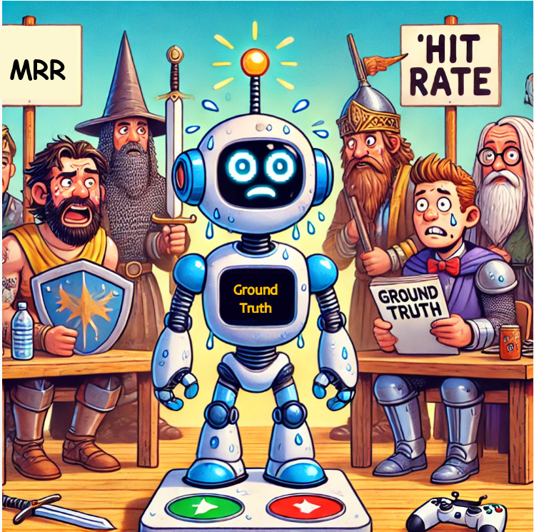

# DAY 3: Retrieval Evaluation

As we dive into Day 3 of our journey with the Interactive Games Instructor Assistant, it’s time to focus on the effectiveness of our retrieval methods. Evaluation is crucial, as it helps us understand how well our system retrieves relevant information and provides accurate game recommendations.

We focus on two key metrics: **Mean Reciprocal Rank (MRR)** and **Hit Rate**, along with the role of ground truth data in this evaluation.

## Key Metrics

### 1. Mean Reciprocal Rank (MRR)

**What It Is**:
- MRR measures how quickly you find a good answer when you ask your assistant a question.

**How It Works**:
- When you ask a question, the assistant tries to find the best answer. If it finds a good answer on the first try, it gets 1 point. If it finds it on the second try, it gets ½ point, and so on.
- MRR gives a score based on the average of these points across multiple questions.

**Why It Matters**:
- MRR is important because it shows how fast the assistant can help you. A high MRR means the assistant is good at quickly finding answers!

### 2. Hit Rate

**What It Is**:
- Hit Rate measures how often the assistant gives you at least one good answer when you ask it a question.

**How It Works**:
- If you ask the assistant 10 questions and it gives you a good answer for 7 of those, the hit rate is 7 out of 10.

**Why It Matters**:
- Hit Rate is important because it tells you how reliable the assistant is. A high hit rate means that the assistant usually finds helpful answers for you!

## Role of Ground Truth Data

**What is Ground Truth Data?**:
- Ground truth data refers to the correct answers or relevant information known to be accurate for a given set of queries. In the context of your Games Instructor Assistant, this includes:
  - Correct answers to common questions about games.
  - Relevant tips, strategies, or game mechanics that users might inquire about.
  - Verified content that can serve as a benchmark for evaluating the assistant's responses.

**Role in Evaluation**:
1. **Baseline for Comparison**: Ground truth data provides a standard against which the assistant's responses can be measured.
2. **Calculation of Metrics**:
   - **Hit Rate**: Ground truth data helps define what constitutes a "good answer." 
   - **MRR**: For calculating MRR, ground truth data is used to determine the rank of the first relevant answer retrieved.

### MRR and Hit Rate

| Feature             | Mean Reciprocal Rank (MRR)                       | Hit Rate                                 |
|---------------------|--------------------------------------------------|------------------------------------------|
| **What It Measures**| Speed of finding useful answers                   | Frequency of finding at least one good answer |
| **Score Type**      | Average score based on the position of relevant answers | Percentage of questions answered well    |
| **Focus**           | How quickly the assistant retrieves relevant answers | How often the assistant retrieves relevant answers |
| **Calculation**     | Average of reciprocal ranks of the first relevant answer for each query | Number of good answers divided by total queries asked |
| **Example**         | If the assistant provides relevant answers at ranks 1, 2, and none: MRR = (1 + 0.5 + 0) / 3 = 0.5 | If you ask 10 questions and get 7 good answers, Hit Rate = 7/10 = 70% |
| **Importance**      | Indicates how efficient and responsive the assistant is in finding answers | Indicates the reliability and overall effectiveness of the assistant in providing useful information |
| **Role of Ground Truth Data** | Provides correct answers to measure accuracy and rank in MRR | Defines what constitutes a "good answer" to calculate hit rate |
---

## Comparison of Evaluation Metrics for Our Games Instructor Assistant

This section compares the evaluation metrics of Hit Rate and Mean Reciprocal Rank (MRR) for a Games Instructor Assistant using different search methods: **MinSearch** and **Weaviate**. The metrics are assessed before and after boosting in MinSearch.

## Summary of Results

### 1. MinSearch
- **Before Boosting:**
  - **Hit Rate**: 0.5519
  - **MRR**: 0.2861
  
- **After Boosting:**
  - **Hit Rate**: 0.8146
  - **MRR**: 0.5880

### 2. Weaviate
- **Hit Rate@10**: 0.9515
- **MRR@10**: 0.7799

## Detailed Comparison Table

| Retrieval Method   | Condition      | Hit Rate        | MRR               | Notes                           |
|------------------|----------------|------------------|-------------------|----------------------------------|
| **Text Search with MinSearch**      | Before Boosting| 0.5519           | 0.2861            | Initial performance, needs improvement |
| **Text Search with MinSearch**      | After Boosting | 0.8146           | 0.5880            | Significant improvement post-boost |
| **Vector Search with Weaviate**      | N/A            | 0.9515           | 0.7799            | Highest performance among methods |

## Boosting Parameters in Minsearch

The following parameters are used in the retrieval process, each representing a specific attribute related to games:

| Parameter                     | Importance Value  |
|-------------------------------|--------------------|
| **gameName**                  | 2.7565             |
| **alternateNames**            | 0.8419             |
| **subcategory**               | 0.6900             |
| **level**                     | 2.8325             |
| **description**               | 1.4647             |
| **playersMax**                | 0.3231             |
| **ageRange**                  | 0.7536             |
| **duration**                  | 1.2133             |
| **equipmentNeeded**           | 1.1704             |
| **objective**                 | 1.3227             |
| **skillsDeveloped**           | 0.5530             |
| **setupTime**                 | 0.6747             |
| **place**                     | 0.7064             |
| **physicalIntensityLevel**    | 1.4951             |
| **educationalBenefits**        | 1.0695             |
| **category**                  | 0.9127             |

### Analysis of Parameters

- **Importance Values**: The higher the value of a parameter, the more important it is in determining the relevance of a game to a user's query. For example, `gameName` and `level` have higher values, indicating they are crucial for retrieving accurate information.
  
- **Impact on Retrieval**: These parameters help refine the search results by prioritizing certain attributes, leading to improved Hit Rate and MRR.

## Analysis

- **MinSearch Performance**: 
  - The results show a considerable improvement after boosting, with Hit Rate increasing from approximately 55% to over 81% and MRR improving from about 29% to nearly 59%. This indicates that the boosting mechanism effectively enhanced the assistant's ability to retrieve relevant information.
  
- **Weaviate Performance**: 
  - The Weaviate search method outperformed MinSearch in both Hit Rate and MRR, achieving Hit Rate@10 of 95.15% and MRR@10 of 77.99%. This suggests that **Weaviate is more effective** for this application, providing high-quality, relevant responses to user queries.

## Conclusion

The evaluation metrics highlight the performance of different search methods for the Games Instructor Assistant. The boost in MinSearch shows that improvements can be made, while Weaviate presents a robust option for achieving high Hit Rate and MRR. Additionally, understanding the importance of the various parameters used in the retrieval process can further guide future development and optimization of the assistant to enhance user experience and information retrieval capabilities.

✨ **Tips of the Day** ✨

1. Update Search Algorithms and Parameters:

    - Regularly review your search algorithms based on evaluation results and consider tweaking the parameters to improve performance. This will enhance the overall accuracy and relevance of your search results.

2. Consider combining text and vector-based retrieval method.

   - We will discuss hybrid search approaches more in-depth on **Day 10**.  Experimenting with hybrid search configurations may lead to better performance in future evaluations.

3. Utilize Evaluation Metrics:

    - Since we currently do not have access to user feedback, we can create a simple tracking system (like a spreadsheet) to record Hit Rate and Mean Reciprocal Rank (MRR) over time. Analysing these trends can help identify which adjustments lead to improvements and highlight any recurring issues that require attention."

---
This concludes the **Day 3** evaluation of retrieval methods, specifically focusing on text and vector searches, with key metrics including Hit Rate and Mean Reciprocal Rank (MRR).

### Upcoming Steps
- Prepare for [**Day 4: RAG Evaluation**](../4-RAG-evaluation/RAG-evaluation.md), where we will compare RAG approaches using GPT-4o and GPT-4o-Mini
