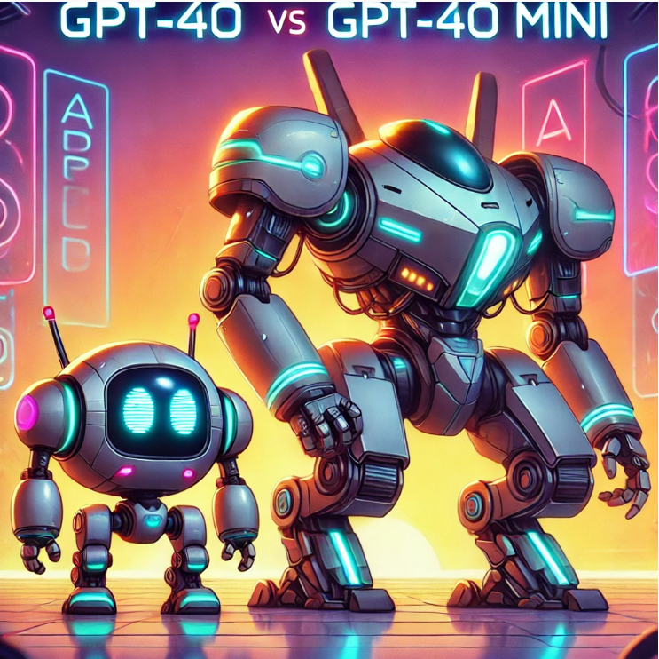

# DAY 4: RAG Evaluation of GPT-4o and GPT-4o-Mini

As we continue our journey with the Interactive Games Instructor Assistant, today we dive deep into the evaluation of different models, specifically **GPT-4o** and **GPT-4o-Mini**. Our focus is on assessing their performance in providing accurate and helpful game-related information using Retrieval-Augmented Generation (RAG).

## What is RAG Evaluation? 🤔
Imagine RAG (Retrieval-Augmented Generation) as a super-smart assistant that helps you find answers to your gaming questions.
RAG evaluation means checking how good our assistant is at answering questions. We want to see if its answers are helpful, correct, complete, and easy to understand. It’s like giving grades to your homework!

In this evaluation, we assessed the performance of **GPT-4o** and **GPT-4o-Mini** based on a selection of 200 questions related to game mechanics, strategies, and tips for various games. The questions were analyzed for their relevance, and responses were categorized into three groups: **RELEVANT**, **NON_RELEVANT**, and **PARTLY_RELEVANT**. The results provide insights into how well each model handles the given queries within the context of a Games Instructor Assistant.

## How Do We Grade Our Assistant? 🎓
We categorize the answers into three criteria:

1. **Relevant**: The answer matches the question and provides useful information.
2. **Partly Relevant**: The answer contains some useful information but does not fully address the question.
3. **Non-Relevant**: The answer does not provide useful information related to the question.

### Let’s Break It Down:
1. **Relevant 🎯**
   - Relevant means the answer fits the question you asked.
   - **Example**:
     - Question: "How long can players expect to spend completing Elden Ring?"
     - Good Answer: "Players can expect to spend 60+ hours completing Elden Ring."
     - Not-so-Good Answer: "The game is quite long."

2. **Partly Relevant ⚠️**
   - Partly relevant means the answer contains some useful information but does not fully cover the question.
   - **Example**:
     - Question: "What are the age requirements to play baseball?"
     - Partly Relevant Answer: "The age requirement to play baseball is 6 years and older." (Does not cover variations for different leagues.)

3. **Non-Relevant ❌**
   - Non-relevant means the answer does not provide useful information related to the question.
   - **Example**:
     - Question: "Can you explain how the scoring system works in Tetris?"
     - Non-Relevant Answer: "The available CONTEXT does not contain information about the scoring system or strategies for Tetris. Please consult a source specifically on Tetris for detailed information on its scoring mechanics and strategy suggestions."

## Comparing Different Assistant Models 🦾

Let’s compare our two models: **GPT-4o** and **GPT-4o-Mini**. We asked them the same questions related to gaming and checked their answers based on the criteria above.

### Example Evaluation:
We selected 200 questions for this evaluation. Here are the results for both models:

### Relevance Counts:
- **GPT-4o-Mini**:
  - **RELEVANT**: 113 responses
  - **NON_RELEVANT**: 63 responses
  - **PARTLY_RELEVANT**: 24 responses
  
- **GPT-4o**:
  - **RELEVANT**: 116 responses
  - **NON_RELEVANT**: 59 responses
  - **PARTLY_RELEVANT**: 25 responses

### Comparison Table

| Metric                | GPT-4o           | GPT-4o-Mini      |
|-----------------------|------------------|------------------|
| **Total Questions**    | 200              | 200              |
| **RELEVANT**           | 116              | 113              |
| **NON_RELEVANT**       | 59               | 63               |
| **PARTLY_RELEVANT**    | 25               | 24               |
| **Relevance Rate (%)** | 58%              | 56.5%            |
| **Non-Relevance Rate (%)** | 29.5%        | 31.5%            |
| **Partly Relevance Rate (%)** | 12.5%      | 12%              |

## Detailed Insights

1. **Overall Performance**:
   - **GPT-4o** slightly outperformed **GPT-4o-Mini** with a **relevance rate of 58%**, compared to **56.5%** for the mini version. This indicates that GPT-4o provided more relevant responses on average in the context of gaming.

2. **Non-Relevant Responses**:
   - **GPT-4o** had a **non-relevance rate of 29.5%**, which is better than **GPT-4o-Mini's** 31.5%. This suggests that GPT-4o is more effective at filtering out irrelevant answers in gaming contexts.

3. **Partly Relevant Responses**:
   - Both models produced a similar number of **partly relevant** responses, indicating that they could occasionally provide useful information, but not fully address the questions related to games.

4. **General Trends**:
   - Both models demonstrated a strong ability to answer gaming-related questions relevantly. However, the slight edge of GPT-4o in relevance metrics may suggest it utilizes its larger architecture to better understand and respond to the nuances of the gaming queries.

5. **Use Case Consideration**:
   - Depending on the specific application, the choice between GPT-4o and GPT-4o-Mini may depend on the balance between performance and resource constraints. For scenarios requiring higher accuracy in gaming instruction, GPT-4o may be preferable, while GPT-4o-Mini could be beneficial for lighter tasks where speed is prioritized.

### Summary of Evaluation
- A total of 200 questions were selected from the ground truth dataset, which can be accessed [Ground Truth Data ](../data/ground-truth-retrieval.csv). Additionally, separate CSV files containing non-relevant questions are available for [GPT-4o-Mini](../data/gpt-4o-mini-nonrelevant.csv) and [GPT-4o](../data/gpt-4o-nonrelevant.csv) 

- Responses were analyzed to determine their relevance based on how well they addressed the users' queries related to gaming.
- The evaluation was aimed at assessing the quality of answers provided by each model, specifically focusing on their ability to deliver relevant information for gaming contexts.

## Conclusion
This evaluation highlights the comparative strengths of **GPT-4o** and **GPT-4o-Mini** in retrieving relevant information for the Games Instructor Assistant. While both models performed well, **GPT-4o** demonstrated slightly superior performance in relevance metrics. However, I chose **GPT-4o-Mini** due to the price difference, making it a more cost-effective solution for providing high-quality gaming assistance

As we reflect on our findings today, we prepare to enhance our Interactive Games Instructor Assistant further by incorporating the insights gained from this evaluation.

---

✨ **Tips of the Day** ✨
1. Focus on systematic testing and evaluation:

- Thoroughly analyze performance metrics and relevance scores to ensure a comprehensive assessment.

2. Understand non-relevant answers:

- Non-relevant responses may occur if the database lacks information on certain games. This does not necessarily reflect the quality of the RAG evaluation.

3. Consider expanding the database:

- For further enhancements, a larger database with more comprehensive game information can significantly improve the assistant's performance.

4. Evaluate sample size impact:

- Keep in mind that we only selected a sample of 200 questions. Increasing the sample size may impact the evaluation results, potentially providing a more accurate representation of the models' capabilities.

5. Experiment with different prompts and models:

- Testing various approaches can enhance the relevance and accuracy of the answers provided.
---

This concludes **Day 4** of our evaluation, where we utilized RAG approaches with the **LLM models** GPT-4o and GPT-4o-Mini.

### Upcoming Steps
- Prepare for [**Day 5: User Interface**](../5-interface/interface.md), where we will begin designing a flowchart for the UI and creating tables in PostgreSQL.

