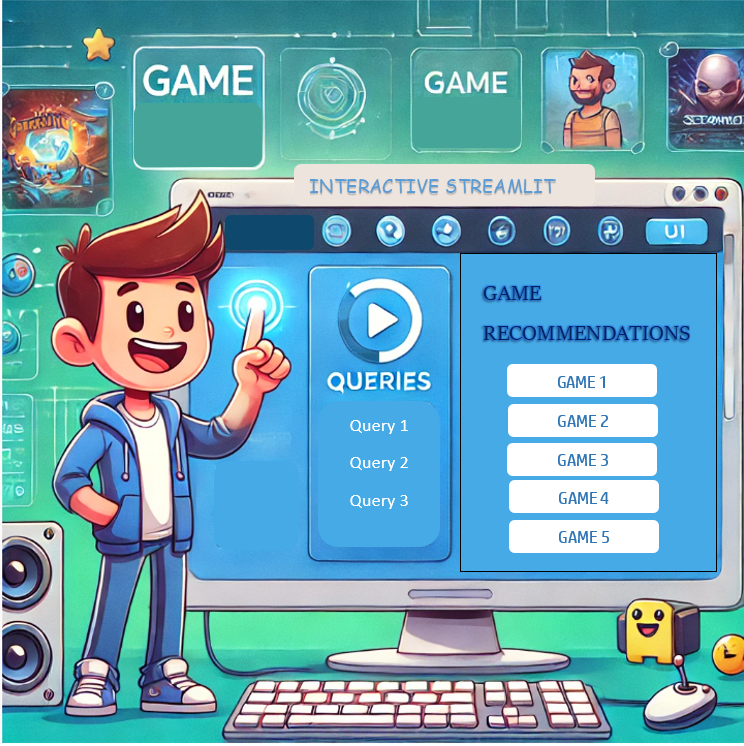
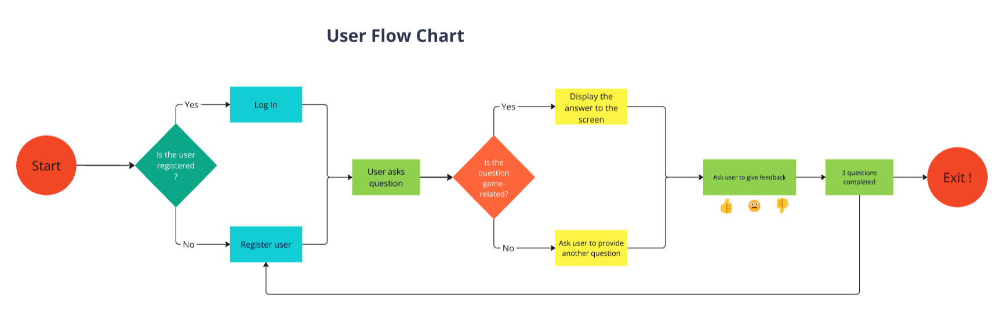
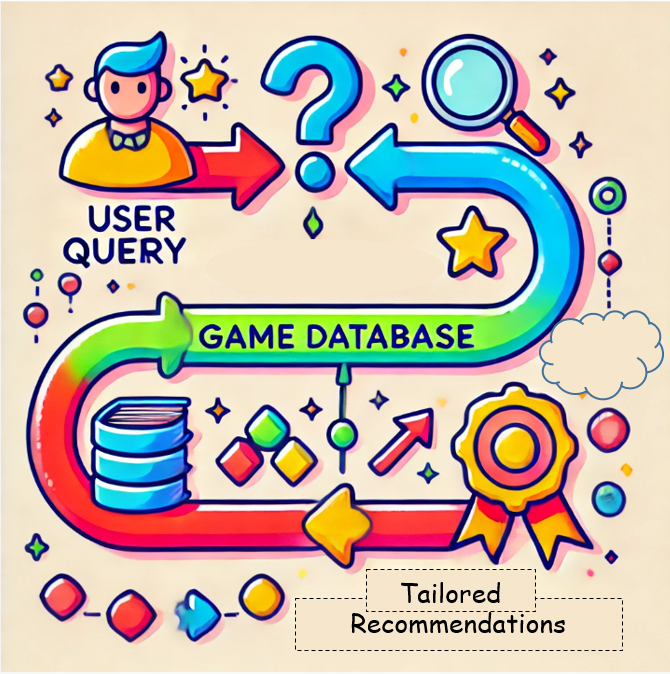

# DAY 5: User Interface

As we embark on Day 5 of our journey with the Interactive Games Instructor Assistant, it's time to focus on creating an intuitive user interface (UI) that allows users to interact seamlessly with the application. A well-designed UI is crucial for enhancing user experience and ensuring that users can easily access the information they need.

## Interface UI with Streamlit
Our interface will feature an interactive web-based UI developed using **Streamlit**, enabling users to input queries and receive game recommendations seamlessly. 

## User Scenario: Jane's Game Searching

When planning a vacation,
I want to use a game app to find entertaining games for my children,
So that I can ensure a fun and enjoyable travel experience for the whole family.

1. Situation

   - Jane is planning a family vacation and wants to find engaging games to entertain her children during the trip.

2. Motivation
   - Jane seeks a seamless and convenient way to discover games that will keep her kids entertained while traveling.

3. Outcome
   - By using the game app, Jane can easily find game options that suit her children's interests and keep them engaged.

### The Questions Jane Can Ask

1. What are some age-appropriate games for my 5-year-old that we can easily play while traveling?

2. Can you suggest engaging group games for my 10 and 12-year-old that can keep them entertained during long trips?

3. What simple, quick games can we play as a family that are suitable for all ages, including my younger and older children?

## User Flow Chart 

### Explanation of the Workflow

Next, we will integrate the LLM to handle user queries effectively. The process will involve the following steps:

1. **User Registration**:
   - The Streamlit UI prompts users to provide their username, age, and gender during the registration process.

2. **Registered User Input**:
   - The user types their query into the input box.
   When a user submits a question, the system will first check if it is related to games.

3. **Game-Related Check and Conditional Processing**:

   - The input is passed to the `is_game_related()`function. If the query is found to be not game-related, the user will be prompted to ask a game-related question. 
   - Conversely, if the query is identified as game-related, the app will rewrite it using various techniques, including:
     - [Paraphrasing](#1-paraphrasing)
     - [Synonym Expansion](#2-synonym-expansion)
     - [Simplification](#3-query-simplification)
     - [Negation](#4-handling-negative-queries-negation)

   -  The user can then retrieve the tailored recommendations. 

## Query Rewriting Techniques for Game-Related Queries

### 1. Paraphrasing
**Purpose**: To restate the original query in different words while maintaining the same meaning.

**Example**:
- **Original Query**: *"What are the best games to play with friends?"*
- **Paraphrased Query**: *"Which games are the most enjoyable to play with friends?"*

### 2. Synonym Expansion
**Purpose**: To replace words in the user’s query with their synonyms, broadening the search results or making the query more comprehensive.

**Example**:
- **Original Query**: *"What’s the best racing game?"*
- **Synonym Expanded Query**: *"What is the best driving game?"* (since “racing” can be replaced with “driving”)

### 3. Query Simplification
**Purpose**: To simplify complex or convoluted user queries into more straightforward, easily understandable versions.

**Example**:
- **Original Query**: *"Can you tell me which video games have the best multiplayer modes for someone who loves co-op play?"*
- **Simplified Query**: *"What are the best multiplayer co-op games?"*

### 4. Handling Negative Queries (Negation)
**Purpose**: To ensure that negative queries are handled correctly, rephrasing them to reflect the user's true intent.

**Example**:
- **Original Query**: *"What are good co-op games without shooting?"*
- **Negation Handled Query**: *"What are good co-op games that do not include shooting?"*

### 5. Spelling Correction
**Purpose**: To ensure that user queries are accurately interpreted by correcting spelling errors, which enhances the system's ability to provide relevant responses.

**Example**:
- **Original Query**: *"ware is the tresure chest?"*
- **Spell-Checked Output**:"Where is the treasure chest?"

---

Now that we've ensured our queries are accurate, you're ready to dive into the world of PostgreSQL and create the essential tables that will bring your application to life!

For detailed instructions on setting up PostgreSQL, including user creation, database management, and table setup, please refer to the [PostgreSQL_Setup_Guide](PostgreSQL_Setup_Guide.md)

This guide covers the following topics:

- Installing PostgreSQL on Ubuntu
- Creating users and databases
- Creating tables and managing privileges

## ✨ Tips of the Day 5 ✨

1. **Choose the Right Interface**: 
   - Choose your interface based on your project needs and the user experience you want to create.

2. **Develop a User Scenario**:
   - Create a basic user scenario that outlines how users will interact with your application. 
3. **Create a Flowchart for the UI**:
   - Design a flowchart that maps out the user journey through the application. This visual representation will help you visualize user interactions.

4. **Implement Query Handling**:
   - Implementing query handling techniques can enhance the robustness of your application, ensuring that users receive accurate responses even if their input contains spelling errors or typos.

5. **Gather Feedback**:
   - Collect user feedback regularly to refine the user experience and improve the functionality of your application.

6. **User Data Collection**:

   - Our application focuses on collecting just the username, gender, and age to enhance the dashboard and maintain user profiles. While adding email and password could improve user accounts, it risks overwhelming users with extra information, potentially discouraging their engagement.

---
**Day 5** serves as an exciting bridge between theory and user interaction, concluding our discussions on user profiles, query handling, and preparations for PostgreSQL.

As we conclude Day 5, we are now ready to roll up our sleeves and jump into action in **Day 6** by building an automated pipeline with a Python script for effortless data import! For more details, check out the [Ingestion Pipeline](../6-ingestion-pipeline/ingestion-pipeline.md).

