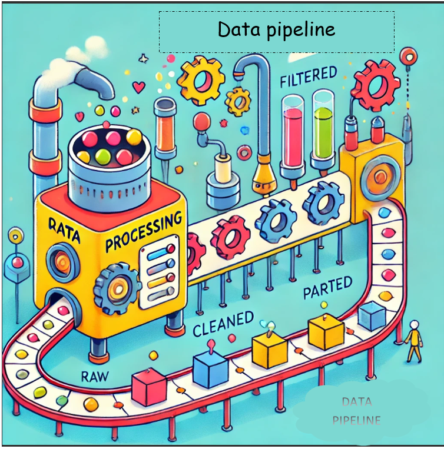
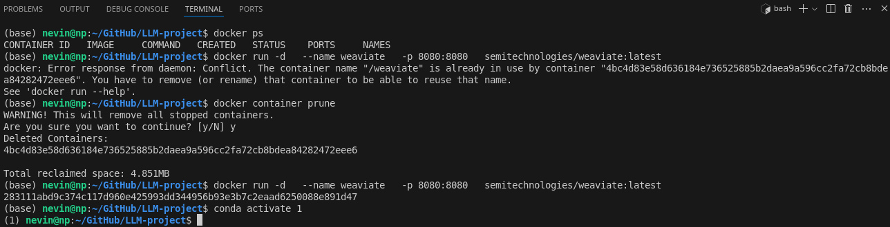
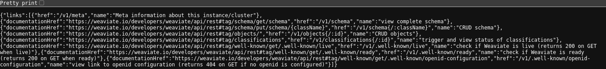
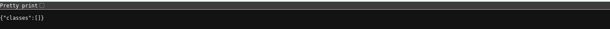
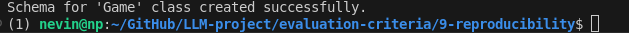
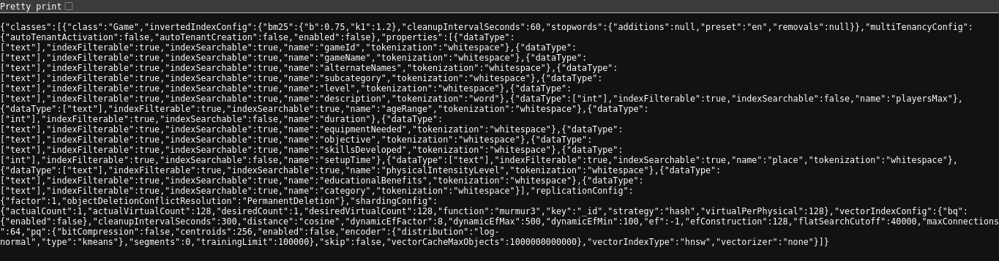
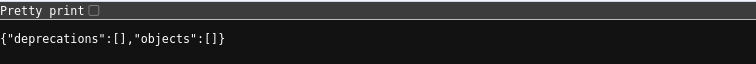
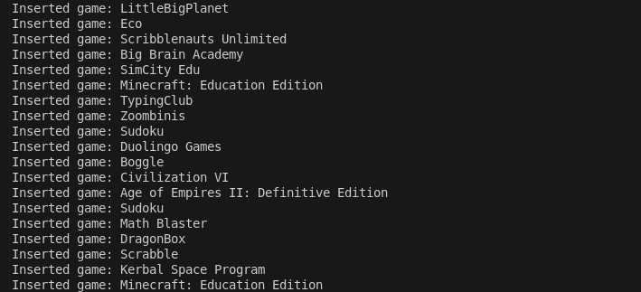
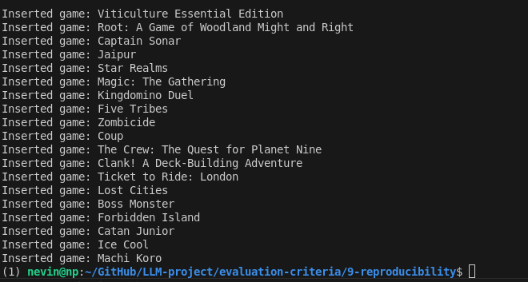
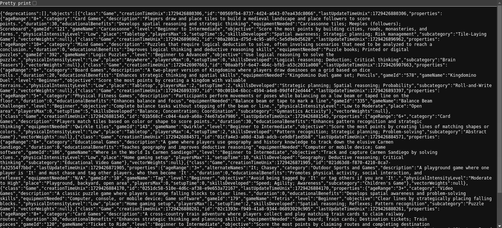

# Day 6: Automated Data Ingestion with Python

Who needs a complicated orchestration tool when you can create a seamless ingestion pipeline with just two simple Python scripts? In this document, we'll walk you through the exciting process of automating data ingestion for a game dataset using Python. Our goal is to keep your dataset fresh and up-to-date without the hassle of manual intervention. Let’s dive in!



## Pipeline Overview

1. **Ensure Weaviate Instance is Running**: Before initiating the data ingestion process, make sure that the Weaviate instance is up and running.

   

   Access the Weaviate API at:
   - [http://localhost:8080/v1](http://localhost:8080/v1)

   

   Check the schema at:
   - [http://localhost:8080/v1/schema](http://localhost:8080/v1/schema)

   

   Access the objects for the Game class at:
   - [http://localhost:8080/v1/objects?class=Game](http://localhost:8080/v1/objects?class=Game)

   > **Note**: This URL will not return any data yet because the Game schema has not been created.

2. **Run the Schema Definition Script**: Execute the schema definition script to create the necessary schema for the Game class.

   ```bash
   python define_schema.py
   ```

   

3. **Check the Schema and Objects Again**: After running the script, verify the schema and objects again.

   - Check the updated schema at:
     - [http://localhost:8080/v1/schema](http://localhost:8080/v1/schema)

     

   - Check the objects for the Game class at:
     - [http://localhost:8080/v1/objects?class=Game](http://localhost:8080/v1/objects?class=Game)

     

   You should now see that the Game class has been created.

4. **Import Data**: Finally, run the data ingestion script to import the game data into Weaviate.

   ```bash
   python ingest_games.py
   ```

   

   The output will indicate that the last game, *Machi Koro*, has been successfully inserted.

   

5. **Verify Data Ingestion**: After importing, check the data in Weaviate once more. 
    - [http://localhost:8080/v1/objects?class=Game](http://localhost:8080/v1/objects?class=Game)

   

   This confirms that the data has been successfully ingested into Weaviate.
---

## Define Schema for Weaviate Client

This script defines the schema for a `Game` class in a Weaviate database. The schema includes various properties relevant to games, allowing for structured storage and retrieval of game-related data.

## Requirements

- Python
- Weaviate Client Library

## Script Overview

The script initializes a Weaviate client and defines the schema for a `Game` class with multiple properties.

### Code Explanation


To create the `Game` class schema in Weaviate, a Python script called `define_schema.py` is run. This script defines the schema for the data that will be stored in the `Game` class, including various properties such as `gameId`, `gameName`, and `description`. The script also includes a method to delete any existing schema to avoid conflicts.

#### `define_schema.py`

- This script connects to the Weaviate instance and defines the schema for the `Game` class.
- It includes properties that describe the game, such as:
  - **gameId**: Unique identifier for each game.
  - **gameName**: Name of the game.
  - **description**: A textual description of the game.
  - Additional properties related to gameplay, audience, and educational benefits.

```python
import weaviate

# Initialize Weaviate client
client = weaviate.Client("http://localhost:8080")  # Adjust the URL if needed

def create_schema():
    # Clear the existing schema (optional, use with caution)
    client.schema.delete_all()

    # Define the schema for the Game class
    game_class_schema = {
        "class": "Game",
        "vectorizer": "none",  # Using manual vectorization with SentenceTransformer
        "properties": [
            {"name": "gameId", "dataType": ["string"]},
            {"name": "gameName", "dataType": ["string"]},
            {"name": "alternateNames", "dataType": ["string"]},
            {"name": "subcategory", "dataType": ["string"]},
            {"name": "level", "dataType": ["string"]},
            {"name": "description", "dataType": ["text"]},
            {"name": "playersMax", "dataType": ["int"]},
            {"name": "ageRange", "dataType": ["string"]},
            {"name": "duration", "dataType": ["int"]},
            {"name": "equipmentNeeded", "dataType": ["string"]},
            {"name": "objective", "dataType": ["string"]},
            {"name": "skillsDeveloped", "dataType": ["string"]},
            {"name": "setupTime", "dataType": ["int"]},
            {"name": "place", "dataType": ["string"]},
            {"name": "physicalIntensityLevel", "dataType": ["string"]},
            {"name": "educationalBenefits", "dataType": ["string"]},
            {"name": "category", "dataType": ["string"]},
        ]
    }

    # Create the Game class in Weaviate
    client.schema.create_class(game_class_schema)
    print("Schema for 'Game' class created successfully.")

if __name__ == "__main__":
    create_schema()
```

### Key Components

- **Weaviate Client Initialization**: The client connects to a Weaviate instance running locally on port 8080.
- **Schema Definition**: The schema includes properties such as `gameId`, `gameName`, `description`, and various other attributes relevant to games.
- **Schema Creation**: The schema is created in the Weaviate database, and an optional step is included to delete any existing schema before creating a new one.


---
## Ingest Games into Weaviate

This script ingests game data from a CSV file into a Weaviate database. It utilizes the SentenceTransformer model for vectorizing game descriptions, allowing for efficient storage and retrieval.

## Requirements

- Python
- Weaviate Client Library
- Pandas
- Sentence Transformers

## Script Overview

The script initializes a Weaviate client and reads game data from a CSV file. It processes the data and ingests it into the Weaviate database.

### Code Explanation

With the `Game` schema in place, the next step is to ingest game data using another Python script called `ingest_games.py`. This script reads data from a CSV file and iterates through each row, extracting relevant information and preparing it for insertion into the Weaviate database.

#### `ingest_games.py`

- This script connects to the Weaviate instance and processes the game data for ingestion.
- It handles various data types and formats, ensuring that the data is clean and correctly formatted before insertion.
- Key functions in the script include:
  - **extract_duration**: Extracts numeric values from duration strings (e.g., converting "90 minutes" to 90).
  - **extract_setup_time**: Extracts numeric values from setup time strings.
  - **parse_players_max**: Converts player limits to integers, handling cases where the input is invalid or unspecified.

- The script then vectorizes the game descriptions using a pre-trained SentenceTransformer model, creating a numerical representation that allows for efficient similarity searches in the Weaviate database.

```python
import pandas as pd
import weaviate
import re
from sentence_transformers import SentenceTransformer
import numpy as np  # Import numpy to check for NaN values

# Initialize Weaviate client
client = weaviate.Client("http://localhost:8080")  # Adjust the URL if needed

# Initialize Sentence Transformer model
model = SentenceTransformer('all-MiniLM-L6-v2')

def extract_duration(duration_str):
    # Extract the numeric part from the duration string (e.g., '90 minutes' -> 90).
    # Returns 0 if the string is not in a valid format.
    if isinstance(duration_str, str):
        match = re.search(r'\d+', duration_str)  # Find the first sequence of digits
        return int(match.group()) if match else 0  # Return the number or 0 if not found
    return 0  # Return 0 if input is not a string

def extract_setup_time(setup_time_str):
    # Extracts the numeric part from the setup time string (e.g., '10-15 minutes' -> 10).
    # Returns 0 if the string is not in a valid format.
    if isinstance(setup_time_str, str):
        match = re.search(r'\d+', setup_time_str)  # Find the first sequence of digits
        if match:
            return int(match.group())
    return 0  # Return 0 if no number is found or input is not valid

def parse_players_max(players_max_str):
    # Parse the playersMax field and return it as an integer.
    # Returns 0 for invalid inputs or 'Not specified'.
    if isinstance(players_max_str, str):
        if players_max_str.lower() in ['not specified', '']:
            return 0
        try:
            return int(players_max_str)  # Convert to int if possible
        except ValueError:
            return 0  # Return 0 if conversion fails
    elif isinstance(players_max_str, (int, float)):
        return int(players_max_str) if not np.isnan(players_max_str) else 0
    return 0  # Default to 0 for other types

def ingest_data(csv_file):
    # Read the CSV file
    data = pd.read_csv(csv_file)

    # Iterate through each row and create a Weaviate object
    for _, row in data.iterrows():
        # Prepare the game data with error handling
        game_data = {
            "gameId": str(row['gameId']) if pd.notnull(row['gameId']) else "",
            "gameName": str(row['gameName']) if pd.notnull(row['gameName']) else "Unknown Game",
            "alternateNames": str(row['alternateNames']) if pd.notnull(row['alternateNames']) else None,
            "subcategory": str(row['subcategory']) if pd.notnull(row['subcategory']) else None,
            "level": str(row['level']) if pd.notnull(row['level']) else None,
            "description": str(row['description']) if pd.notnull(row['description']) else "No description available.",
            "playersMax": parse_players_max(row['playersMax']),  # Use the new function
            "ageRange": str(row['ageRange']) if pd.notnull(row['ageRange']) else "N/A",
            "duration": extract_duration(row['duration']),  # Use the existing function
            "equipmentNeeded": str(row['equipmentNeeded']) if pd.notnull(row['equipmentNeeded']) else "N/A",
            "objective": str(row['objective']) if pd.notnull(row['objective']) else "N/A",
            "skillsDeveloped": str(row['skillsDeveloped']) if pd.notnull(row['skillsDeveloped']) else "N/A",
            "setupTime": extract_setup_time(row['setupTime']),  # Use the existing function
            "place": str(row['place']) if pd.notnull(row['place']) else "N/A",
            "physicalIntensityLevel": str(row['physicalIntensityLevel']) if pd.notnull(row['physicalIntensityLevel']) else "N/A",
            "educationalBenefits": str(row['educationalBenefits']) if pd.notnull(row['educationalBenefits']) else "N/A",
            "category": str(row['category']) if pd.notnull(row['category']) else "N/A"
        }

        # Vectorize the game description
        description_vector = model.encode(game_data['description']).tolist()  # Convert numpy array to list

        # Add the object to Weaviate with the vector
        try:
            client.data_object.create(
                data_object=game_data,
                class_name="Game",
                vector=description_vector  # Provide the vectorized description
            )
            print(f"Inserted game: {game_data['gameName']}")
        except Exception as e:
            print(f"Failed to insert game: {game_data['gameName']}. Error: {e}")

if __name__ == "__main__":
    ingest_data("../data/game-dataset.csv")  # Ensure the CSV file is in the correct path
```

### Key Components

- **Weaviate Client Initialization**: The client connects to a Weaviate instance running locally on port 8080.
- **SentenceTransformer Model**: A model is initialized to vectorize game descriptions.
- **Data Processing**: Functions to extract relevant data from the CSV file and handle various formats and errors.
- **Data Ingestion**: The script reads the game data and ingests it into Weaviate, with error handling for each insertion.


### Conclusion

By utilizing simple Python scripts, a reliable and efficient data ingestion pipeline is created for a dataset of 590 game entries. This approach avoids the complexities and inconsistencies encountered with orchestration tools, ensuring smooth and consistent data processing.

---

✨ **Tips of the Day** ✨

1. **Ensure Weaviate Instance is Running**: 

- Always ensure that the Weaviate server is operational and accessible before executing the script to avoid connection issues. This is crucial for both schema creation and data ingestion.

2. **Verify Schema Creation**:

- After confirming that the Weaviate instance is operational, it's essential to verify that the `Game` schema has been successfully created. You can do this by checking the schema and objects endpoints in your Weaviate instance to ensure the presence of the `Game` class.


3. **Important Note**:
- Use the `client.schema.delete_all()` line with caution, as it will remove all existing schemas from the Weaviate instance.


4. **Schema Consistency**: Ensure that the CSV columns match the property names defined in the schema. Any discrepancies can lead to insertion errors.
 
5. **Performance Optimization**: For larger datasets, consider batching the insertions to improve performance and reduce the number of API calls.
6. **Logging Enhancements**: Instead of using print statements, consider integrating Python's logging module for more flexible and configurable logging.
7. **Data Validation**: Implement additional validation to ensure data integrity before insertion, such as checking for duplicate entries.
8. **Error Reporting**: Maintain a log of failed insertions for later review and reprocessing.

---

As we wrap up **Day 6**, we've successfully ensured that our Weaviate instance is running, verified the creation of the **Game schema**, and ingested the entie dataset. This structured approach has laid a solid foundation for managing our game data effectively.

## Next Steps: 
On [**Day 7**](../7-best-practices/best-practices.md) ,we will shift our focus to : 
- Hybrid Search
- Document Reranking
- Query Handling