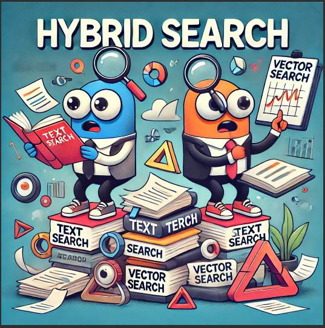
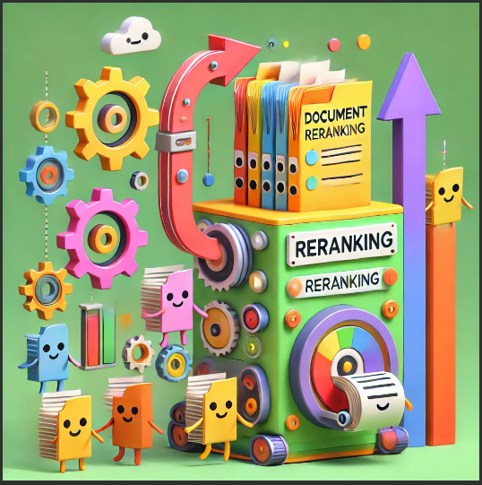

# Day 7: Best Practices 
# Hybrid Search and Document Reranking

As we transition from the automated data ingestion process covered in [Day 6](../6-ingestion-pipeline/ingestion-pipeline.md), we’re diving into the exciting world of **hybrid search** and **document re-ranking** for the best practices. Let's explore how these enhancements will help us find the perfect game more efficiently.

## A Quick Recap of Day 6

Before diving into today's advancements, let's briefly revisit what we accomplished on **Day 6**:

- **Defined the Schema in Weaviate**: We used `define_schema.py` to establish a structured schema in Weaviate.

- **Ingested Game Data**: We imported **590 games** into Weaviate using `ingest_games.py`. This provided us with a solid database to perform searches.

With our data properly structured and stored in Weaviate, we were ready to enhance our search capabilities further.

### Why We Used `index_weaviate.py` Today

You might wonder why we used `index_weaviate.py` instead of `ingest_games.py` today.

- **`ingest_games.py`**: This script is designed for the initial ingestion of game data into Weaviate. It loads the data according to the defined schema but doesn't prepare it for advanced search functionalities.
- **`index_weaviate.py`**: This script not only ingests the data but also **indexes** it, optimizing for advanced features like hybrid search and faster retrieval times.

#### Why Didn't We Use `index_weaviate.py` on Day 6?

On Day 6, our goal was to set up the basic structure and get our data into Weaviate. `ingest_games.py` was sufficient for this initial step. Today, we needed to enhance our search capabilities, which required indexing the data differently. Hence, we introduced `index_weaviate.py` to prepare the data specifically for hybrid search.

## Today's Focus: Making Search Smarter and Faster

### What We Did Today

- **Implemented Hybrid Search**: We combined **vector search** and **keyword search** to leverage the strengths of both methods.
- **Introduced Document Reranking**: We refined search results by rearranging them to prioritize the most relevant games at the top.

### Understanding Weaviate

**Weaviate** is an open-source vector search engine that enables semantic search through machine learning. It allows us to understand not just the keywords in a search query but also the context and meaning behind them. This makes our search more accurate and intuitive. For more information you can revisit Day3.

### What is Hybrid Search?

Hybrid search in Weaviate combines two types of search methods:
1. **Text Search**: This method uses traditional keyword matching to find documents that contain the exact words from a query.
2. **Vector Search**: This method utilizes embeddings generated from machine learning models (like Sentence Transformers) to find semantically similar documents based on the meaning of the query, rather than just keyword matching.

### How Weaviate Implements Hybrid Search

- **Embedding Generation**: When a query is made, Weaviate generates an embedding for the input text using a pre-trained model (e.g., Sentence Transformer). This embedding captures the semantic meaning of the query.
- **Query Execution**: Weaviate performs the hybrid search by executing a query that combines both:
  - **Keyword search** for exact matches.
  - **Vector search** using the embedding to find relevant documents.
- **Alpha Parameter**: The hybrid search functionality allows for the adjustment of the **alpha** parameter, which controls the balance between keyword and vector search. For instance, setting `alpha=0.5` gives equal weight to both methods.

## Making Sense of Document Reranking

### What is Document Reranking?

Imagine you have a large pile of game descriptions—in our case, **2950** rows of ground truth data (which is **590 games** each evaluated with **5 different queries**). When you search for a game, the system first retrieves an initial list of potential matches. Document reranking helps us reorder this list so that the most relevant games appear at the top.

### How Does It Work?

1. **Initial Retrieval**: The system retrieves a set of potential games based on the initial search (could be keyword search, vector search, or hybrid search).
2. **Reranking Process**: Using the ground truth data, we evaluate how relevant each game is to the user's query.
3. **Final Results**: The games are reordered based on their relevance scores, ensuring that the most relevant games are presented first.

### Why Does Rank Size Matter?

- **Rank Size**: This is the number of top initial results we consider for reranking.
- We experimented with different rank sizes—**10**, **20**, and **50**—to determine which provides the best balance between performance and computational efficiency.
- **Rank Size 10** gave us the best results because it focuses on a smaller, more relevant set of games, making reranking more effective and faster.

## The Results: How Did Our Improvements Perform?

### Magic Number `k = 10`

In our searches, **`k`** represents the number of top results we want to retrieve. Setting `k = 10` means we're requesting the **top 10** most relevant games for a query. This number strikes a balance—it provides enough options without overwhelming the user.

We evaluated our search methods using two key metrics:

- **Hit Rate@10**: The percentage of searches where the correct game appears in the top 10 results.
- **MRR@10** (Mean Reciprocal Rank): Measures how high the correct game ranks on average (higher is better).

### Overall Performance Comparison

Here's how all our methods compare:

| **Retrieval Method**                      | **Condition**         | **Hit Rate@10** | **MRR@10** | **Notes**                                      |
|-------------------------------------------|-----------------------|-----------------|------------|------------------------------------------------|
| Text Search with MinSearch                | Before Boosting       | 55.19%          | 0.2861     | Low relevancy in top results; needs improvement.         |
| Text Search with MinSearch                | After Boosting        | 81.46%          | 0.5880     | Significant improvement due to boosting parameters.        |
| Vector Search with Weaviate               | N/A                   | 95.15%          | 0.7799     | High relevance using vector embeddings and relies on semantic similarity.         |
| **Hybrid Search with Weaviate**               | N/A                   | **97.15%**          | **0.8177**     | **Excellent balance of keyword and vector searches.**             |
| Document Reranking    | Rank Size 50          | 96.85%          | 0.8092     | Reranking top 50 results and maximizes relevancy by optimizing result order.                       |
| Document Reranking    | Rank Size 20          | 97.02%          | 0.8120     | Reranking top 20 results and maximizes relevancy by optimizing result order.                        |
| **Document Reranking**    | **Rank Size 10**      | **97.15%**      | **0.8146** | **Best performance with reranking top 10 results. Maximizes relevancy by optimizing result order.** |

### Analysis of Results

- **Hybrid Search** significantly outperforms basic text and vector searches.
- **Document Reranking** with a rank size of 10 provides the best balance of accuracy and efficiency.
- **Hit Rate@10** and **MRR@10** improve as the rank size decreases to 10 during reranking, indicating more relevant results appearing at the top.

### Why Rank Size 10 Gives the Best Results

- **Efficiency**: Processing fewer items during reranking reduces computation time (only **25 minutes** for rank size 10).
- **Effectiveness**: Focusing on the top 10 initial results allows the reranking algorithm to fine-tune the most promising candidates, enhancing the chances of the correct game ranking higher.

## Conclusion

Today's enhancements have significantly improved our search capabilities within the Games Instructor Assistant:

- **Hybrid Search**: Combining vector and keyword searches resulted in a Hit Rate@10 of **97.15%** and an MRR@10 of **0.8177**.
- **Document Reranking**: Further refined our results, achieving a Hit Rate@10 of **97.15%** and an MRR@10 of **0.8146** with a rank size of 10.

These advancements mean that when you search for a game, you're more likely to find exactly what you're looking for, quickly and accurately. For further details and code examples, refer to the relevant sections in [**Day 3**](../3-retrieval-evaluation/retrieval-evaluation.md) and [**Day 6**](../6-ingestion-pipeline/ingestion-pipeline.md).

---

 ✨ **Tips of the Day** ✨

1. **Consider Best Practices**
   - **Hybrid Search & Document Reranking**: While we explored these techniques for evaluation, they were not implemented due to the already high performance of vector search, which achieved a Hit Rate@10 of **95%**. Use these methods only when essential and if you are confident in your ability to handle their complexities.

2. **Adjust Hybrid Search Parameters**
    -  Experiment with Alpha: If implementing hybrid search, adjust the alpha parameter to balance the influence of keyword and vector search. Fine-tuning this can significantly impact the quality of search results.

3. **Understand Your Tools**

   - Use **`ingest_games.py`** for data ingestion and **`index_weaviate.py`** for optimizing and indexing data. 

4. **Maintain Documentation**
   - Keep thorough records of modifications and features to aid understanding and simplify debugging.

5. **Insights on Rank Size**
   - A smaller rank size does not always guarantee an improved hit rate. The effectiveness depends on the quality of the initial retrieval and the diversity of your dataset. It's essential to experiment with different rank sizes to determine what works best for your specific application.

---
These tips will help ensure efficient and accurate search functionality. Be sure to regularly evaluate and adjust based on performance metrics and user feedback.

This concludes **Day 7: Best Practices** for:
- Hybrid Search  
- Document Reranking

---
## What's Next?

As we move forward, we'll shift our focus to implementing the application. [**Day 8**](../8-monitoring/monitoring.md) includes several key activities:

   - Evaluate the functionality of the UI by adding dummy users and monitoring their interactions.
   - Query Handling: This will be addressed by asking selected questions to dummy users.
  - Thoroughly test the application’s performance.
  - Set up dashboards to visualize key metrics and ensure a seamless user experience.
