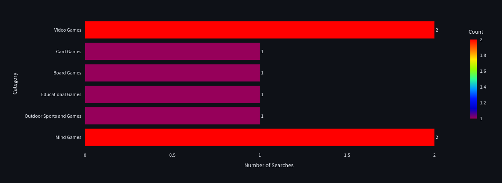

# Day 8: Monitoring in the Games Instructor Assistant

Welcome to Day 8 of my exciting journey with the **Game Instructor Assistant**! 🎉 Today, I will dive into the critical aspects of monitoring user engagement, tracking feedback, and analyzing both game-related and non-game-related queries through the query handling processes. 

By closely observing user interactions, gathering feedback, and rigorously testing the system, I aim to enhance the overall experience and continuously improve this platform. Let’s get started on this insightful exploration!

## 🎭 The Journey of Dummy Users

Before launching into query handling, I created a series of **dummy users** for general querying to simulate realistic interactions. Below, you can see their initial queries and the results they received:

### Overview of Dummy Users

Here are the dummy users created prior to implementing query handling:

- **Non-Game Related Questions:** 1, 2, 3, 7, 9  
- **Game-Related Questions:** 4, 5, 6, 8  

**User Profiles:**

- **Jamie**  
  

- **Luke**  
  

- **Player1**  
  

- **Noah**  
  

### Introducing Wonderwoman, Xmen, and Emma

To enhance my exploration of query handling, I created two additional dummy users—**Wonderwoman** and **Xmen**—after initially setting up 9 users for general queries. **Emma**, who was created earlier, also plays a role in demonstrating the application’s query handling capabilities.

First, **Wonderwoman** shows how the system processes and refines user queries. Her interactions emphasize the importance of clear communication and demonstrate how effective query handling can improve the user experience.

Next, **Xmen** illustrates the application’s flexibility in managing different types of inquiries. Finally, **Emma** adds variety by representing a younger user perspective.

Together, Wonderwoman, Xmen, and Emma provide a clear example of the query handling process and its positive impact on user satisfaction.

---
### Query Handling with Wonderwoman

| user_name      | gender | age | original_question                                      | rewritten_question                                                   | feedback_type |
|----------------|--------|-----|--------------------------------------------------------|-----------------------------------------------------------------------|---------------|
| **Wonderwoman**| **Female** | **24** | **"What are the best games to play with friends?"**      | **"What are the top games to enjoy with friends?"**                   | **up**        |
| **Wonderwoman**| **Female** | **24** | **"What’s the best racing game?"**                        | **"What is the top racing game?"**                                     | **neutral**   |
| **Wonderwoman**| **Female** | **24** | **"Can you tell me which video games have the best multiplayer modes for someone who loves co-op play?"** | **"What are the top video games with excellent multiplayer modes for fans of cooperative play?"** | **up**        |

In this video, you will see how the system handles queries with **Wonderwoman**. This showcases the process of refining user inquiries for improved clarity and response quality.

  

### Query Handling with Xmen and Emma

| user_name | gender | age | original_question                                      | rewritten_question                                                               | feedback_type |
|-----------|--------|-----|--------------------------------------------------------|-----------------------------------------------------------------------------------|---------------|
| **Xmen**  | **Other** | **29** | **"What are good co-op games without shooting?"**        | **"What are some enjoyable cooperative games that do not involve shooting?"**      | **down**      |
| **Xmen**  | **Other** | **29** | **"ware is the tresure chest?"**                        | **"Where is the treasure chest?"**                                               | **neutral**   |
| **Xmen**  | **Other** | **29** | **"Can you suggest some time management techniques?"**    | **"Could you recommend some strategies for managing time effectively?"**          | **up**        |
| **Emma**  | **Female** | **16** | **"Can you list immersive adventure games?"**            | **"Could you provide a list of engaging adventure games?"**                   | **up**        |
| **Emma**  | **Female** | **16** | **"What are the top action-packed games available?"**   | **"What are the best exciting games that are currently available?"**  | **neutral**   |

This video highlights the query handling process with **Xmen** and **Emma**. It illustrates how the system effectively manages diverse queries, ensuring users receive accurate and relevant information.

  

## Query Handling Techniques

1. **Paraphrasing**
   - **Purpose:** Restates the original query using different words while maintaining the same meaning.
   - **Examples:**
     - **Original:** "What are the best games to play with friends?"
       - **Rewritten:** "What are the top games to enjoy with friends?"
       - **Change Details:** Replaced "best" with "top" and "play" with "enjoy" to convey the same intent using alternative phrasing.
     - **Original:** "What’s the best racing game?"
       - **Rewritten:** "What is the top racing game?"
       - **Change Details:** Replaced "best" with "top" to maintain the same meaning with different wording.

2. **Synonym Expansion**
   - **Purpose:** Replaces words in the user’s query with their synonyms to broaden or refine the search scope.
   - **Examples:**
     - **Original:** "What are the top action-packed games available?"
       - **Rewritten:** "What are the best exciting games that are currently available?"
       - **Change Details:** Replaced "action-packed" with "exciting " to enhance descriptive quality.
     - **Original:** "Can you list immersive adventure games?"
       - **Rewritten:** "Could you provide a list of engaging adventure games?"
       - **Change Details:** Replaced "immersive" with "engaging" and "Can you list" with "Could you provide a list of" to use synonyms and more formal phrasing.

3. **Query Simplification**
   - **Purpose:** Simplifies a complex or lengthy query into a more straightforward and easily understandable version.
   - **Example:**
     - **Original:** "Can you tell me which video games have the best multiplayer modes for someone who loves co-op play?"
       - **Rewritten:** "What are the top video games with excellent multiplayer modes for fans of cooperative play?"
       - **Change Details:** Removed unnecessary phrases like "Can you tell me which" and replaced "someone who loves" with "fans of" for clarity and brevity.

4. **Handling Negative Queries (Negation)**
   - **Purpose:** Rephrases negative aspects of a query to clearly reflect the user’s intent without ambiguity.
   - **Example:**
     - **Original:** "What are good co-op games without shooting?"
       - **Rewritten:** "What are some enjoyable cooperative games that do not involve shooting?"
       - **Change Details:** Replaced "without shooting" with "that do not involve shooting" to explicitly state the exclusion, enhancing clarity.

5. **Spelling Correction**
   - **Purpose:** Corrects spelling errors to ensure accurate interpretation and processing of the query.
   - **Example:**
     - **Original:** "ware is the tresure chest?"
       - **Rewritten:** "Where is the treasure chest?"
       - **Change Details:** Corrected misspelled words: "ware" → "Where" and "tresure" → "treasure".

---
## Summary of Query Handling Techniques Applied

| **Original Question**                                                                                             | **Rewritten Question**                                                                                                      | **Techniques Applied**                        |
|-------------------------------------------------------------------------------------------------------------------|------------------------------------------------------------------------------------------------------------------------------|-----------------------------------------------|
| "What are the best games to play with friends?"                                                                    | "What are the top games to enjoy with friends?"                                                                               | **Paraphrasing**                             |
| "What’s the best racing game?"                                                                                       | "What is the top racing game?"                                                                                               | **Paraphrasing**                             |
| "Can you tell me which video games have the best multiplayer modes for someone who loves co-op play?"                | "What are the top video games with excellent multiplayer modes for fans of cooperative play?"                                | **Query Simplification**, **Paraphrasing**    |
| "What are good co-op games without shooting?"                                                                        | "What are some enjoyable cooperative games that do not involve shooting?"                                                   | **Handling Negative Queries (Negation)**      |
| "ware is the tresure chest?"                                                                                        | "Where is the treasure chest?"                                                                                                | **Spelling Correction**                       |
| "What are the top action-packed games available?"                                                                    | "What are the best exciting games that are currently available?"                                                     | **Synonym Expansion**, **Paraphrasing**        |
| "Can you list immersive adventure games?"                                                                              | "Could you provide a list of engaging adventure games?"                                                                        | **Synonym Expansion**, **Paraphrasing** 
---

## 📊 Dashboard Overview

Finally, I am excited to present our comprehensive **Dashboard**. This powerful tool brings together user analytics, feedback analytics, game analytics, chat history analytics, and hit rate and MRR analytics into a unified view. Serving as the command center for our project, this dashboard enables me to effectively monitor progress, gain insights into user behavior, and identify opportunities for future enhancements.

  

## 👤 User Analytics: Understanding Our Players

Our **User Analytics** dashboard is a treasure trove of information about our community. It paints a vivid picture of who our users are and how they engage with our platform. Here’s what we can glean from the data:

- **Total Users:** Currently, we have **11** active users who bring a variety of perspectives and gaming preferences to our community.
  

- **Users by Gender:** Understanding the gender distribution among our users helps us create content and features that resonate with different demographics. This insight is crucial for developing marketing strategies and community initiatives.

- **Age Distribution of Users:** Knowing the age range of our users allows us to tailor our recommendations and content. For example, younger users might prefer different game genres compared to older users.

## 📝 Feedback Analytics: Listening to Our Community

The **Feedback Analytics** dashboard is where the voices of our users resonate most clearly. With a total of **17** feedback submissions, we are able to gather valuable insights into user satisfaction and areas needing improvement. 

- **Feedback Types Distribution:** This section categorizes feedback into upvotes, neutral comments, and downvotes, allowing us to assess overall user sentiment. A higher number of upvotes indicates a positive experience, while neutral and down votes highlight areas that require our attention.

- **Feedbacks Over Time:** Tracking feedback over time helps us identify trends and fluctuations in user sentiment. This data can reveal how recent updates or changes to the platform impact user experience, guiding our future enhancements.

The insights gained from this dashboard are instrumental in shaping the direction of our project and ensuring that we meet the needs of our users.

---

## 🎮 Game Analytics: What’s Trending?

Our **Game Analytics** dashboard is dedicated to understanding the gaming preferences of our users. This section is critical for identifying which games are drawing attention and engagement.

- **Total Searched Games:** We’ve seen a total of **8** games searched so far, showcasing user interests and potential gaps in our current offerings.

### Popular Game Searches

Analyzing the **Top 10 Searched Games** gives us insight into what our users are excited about. By understanding their interests, we can enhance our game database and offer personalized recommendations that keep users engaged.

This dashboard also includes key metrics related to searched games, such as breakdowns by category (e.g., action, puzzle, strategy) and subcategory, enabling us to curate a tailored gaming experience.

----

---

---

## 🔍 Search Performance Metrics: Optimizing User Experience

In the **Search Performance Metrics** dashboard, we focus on the effectiveness of our search algorithms. This area is pivotal for enhancing user satisfaction as it directly impacts how easily users can find the games they're looking for.

- **Key Metrics:** Here, we analyze metrics like Hit Rate@10 and Mean Reciprocal Rank (MRR@10). These metrics reveal how well our search methods are performing, allowing us to fine-tune our algorithms to deliver relevant results.

- **Hit Rate Comparison:** Comparing hit rates across different search methods provides insights into which approaches yield the best user satisfaction.

- **MRR Comparison:** This metric helps us understand how well the search results rank for users, guiding our optimization efforts to improve the overall search experience.

---

### 📦 Gearing Up for Day 9 and Beyond
- [**Day 9**](https://github.com/nevinpolat/game4every1?tab=readme-ov-file#day-9-docker-integration-smooth-sailing-with-docker-compose). Get ready to dive into the world of containers! 🚢 On Day 9, we're leveling up our Game Finder application by containerizing it with Docker. This move is a game-changer for our deployment process, promising scalability and portability that sails smoothly across any sea of data.

- [**Day 10**:](https://github.com/nevinpolat/game4every1?tab=readme-ov-file#day-10-reproducibility) Pen to paper, we'll craft a `README.md` that not only ensures our work is reproducible but also serves as a beacon for all collaborators.

- [**Day 11**:](https://github.com/nevinpolat/game4every1?tab=readme-ov-file#day-11-game4every1-in-streamlit-cloud) It's lift-off time as we deploy our application to the cloud, boosting accessibility and extending our reach into the skies.

